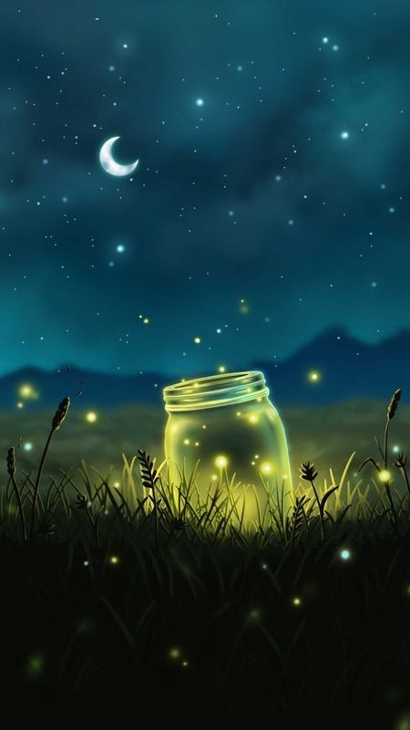

# Dear Moon

This is my first react web page. I want it to be a space that I talk about things that are close to my hurt. I also want it to be a place of beauty. I guess this will be a DBT blog LOL. Where I admire the beauty of nature and life and also speak about the difficulties of life. I guess this will be a space to hold both.

## How to use
- Please click the [link](https://kanyisa-ntombini.github.io/dear-moon/) to view the live website. 
- This is the [link](https://www.codecademy.com/article/how-to-create-a-react-app) to the codecademy website for how to create a react app

## Features
- Lots of cosiness because its winter!!

## Technologies
- HTML
- CSS
- REACT
- Figure => [This](https://www.figma.com/file/8SbPc4KIvKfsWM7Uwm1OEL/Dear-Moon-Blog?node-id=2%3A2&t=uBxt0OcPZIRRdm0c-1) is the link to the figma project